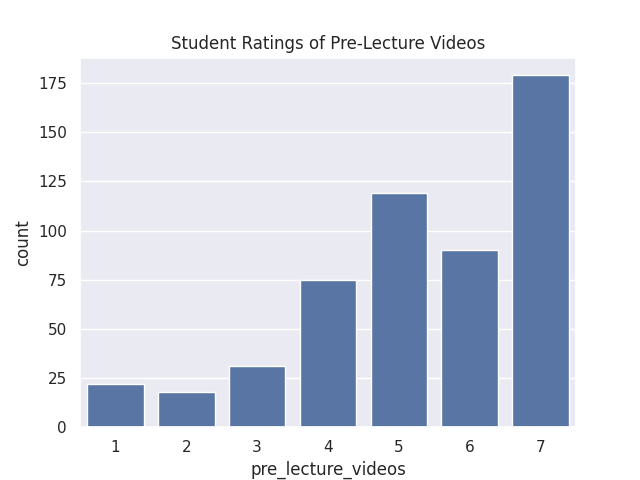
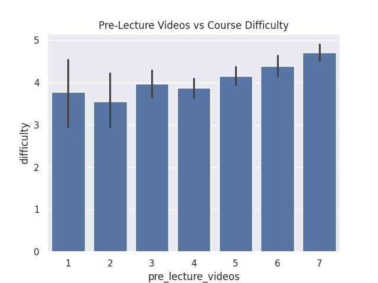
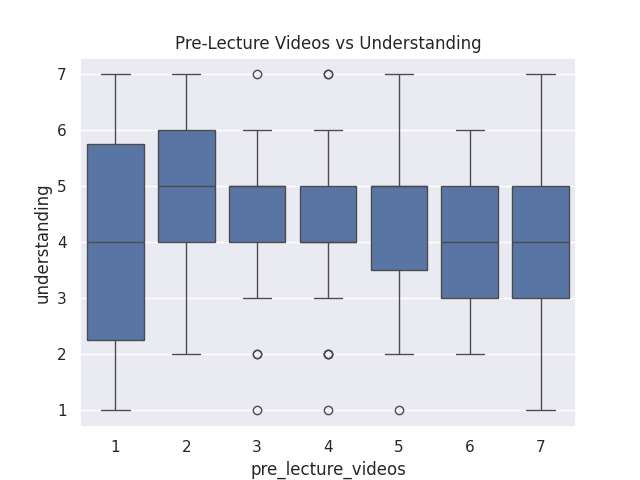

---
# Do not edit the text between these lines!
layout: default
---

# This is a big header

<!-- This is a comment. Below, you'll see code for inserting an image. To make this image appear, update <custom-path>. To add an image, save it inside the imgs folder of this repository. -->
/static/imgs/logo.png" alt="Image of Comp110 rainbow logo. "  width="500"/>

## This is a small header

This is basic paragraph text.

# COMP110 Data Analysis Project

## Project Idea
The course should include optional pre-lecture videos because they can help students preview material and better understand the course, especially for those who find the course difficult.

---

## Data Analysis

### 1. Student Interest in Pre-Lecture Videos
Most students rated pre-lecture videos highly (5–7), suggesting that students believe these videos would be helpful if they were added to the course.

---

### 2. Pre-Lecture Videos vs Course Difficulty
Students who rated pre-lecture videos more highly also reported higher course difficulty. This suggests that students who find the course more challenging are more likely to want pre-lecture videos.

---

### 3. Pre-Lecture Videos vs Understanding
Students with lower or more varied understanding tend to rate pre-lecture videos more highly. This indicates that pre-lecture videos could help students who struggle to fully understand the material.

---

## Conclusion
The data supports adding optional pre-lecture videos to the course. Students believe they would be helpful, especially those who find the course difficult or have lower understanding. While creating these videos may require additional effort from instructors, they could significantly improve student learning and overall course experience.